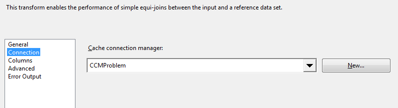
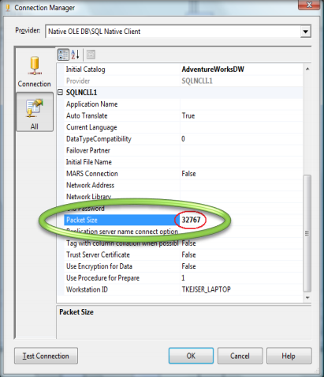
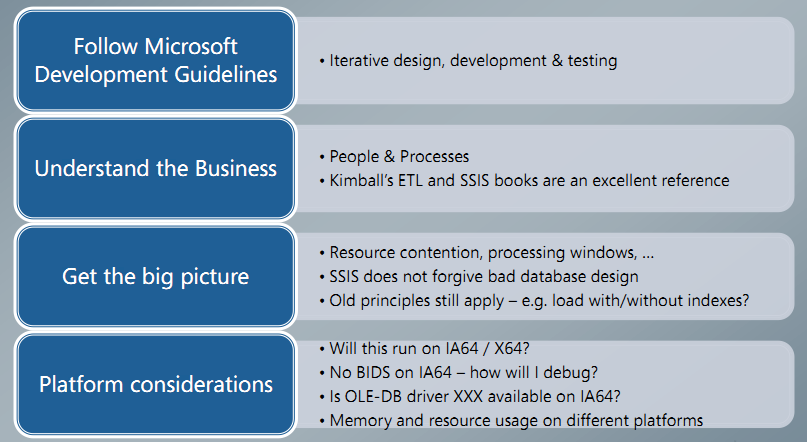
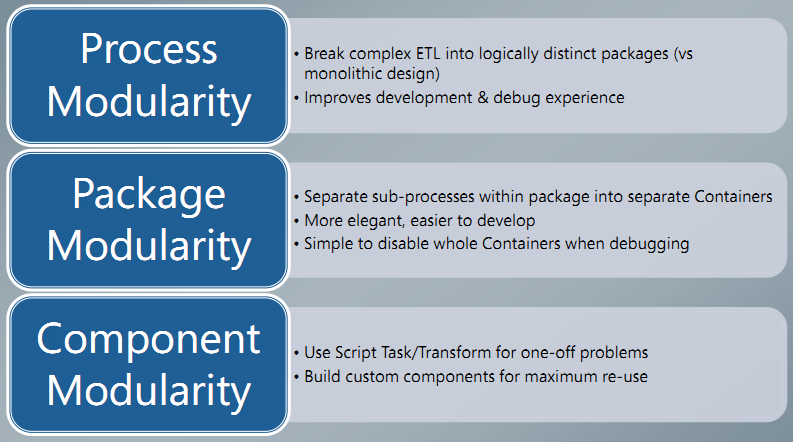
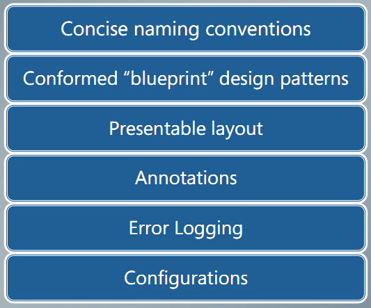
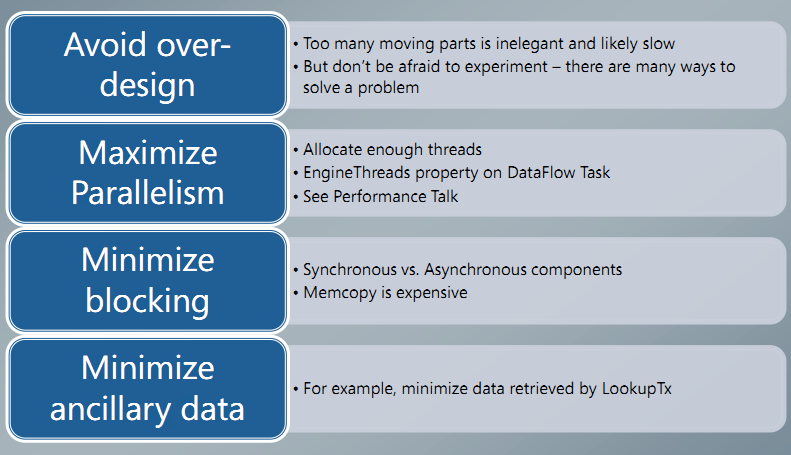
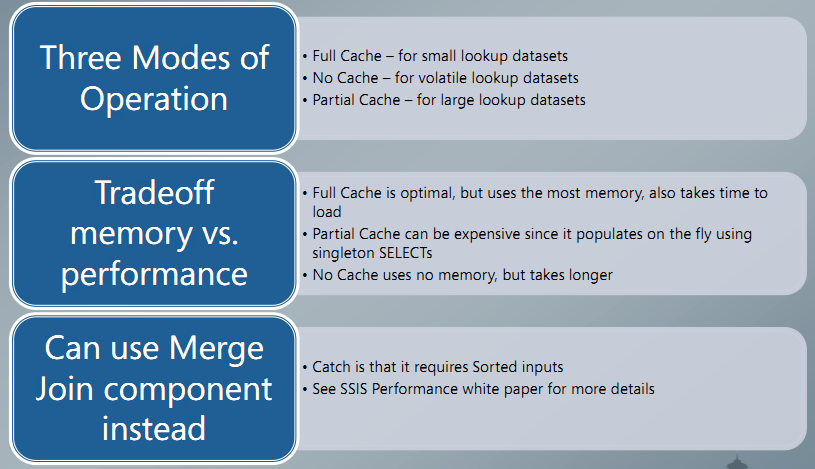
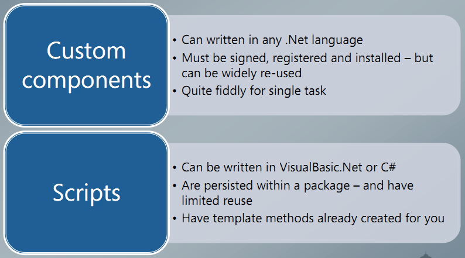

# KMS ETL-SSIS Coding Standards

  - [1. Purpose](#1-purpose)
  - [2. Common Naming Conventions](#2-common-naming-conventions)
  - [3. Database Naming Conventions](#3-database-naming-conventions)
      - [3.1 Tables](#31-tables)
      - [3.2 Columns](#32-columns)
      - [3.3 Views](#33-views)
      - [3.4 Store procedures](#34-store-procedures)
      - [3.5 Primary Keys](#35-primary-keys)
      - [3.6 Foreign Keys](#36-foreign-keys)
      - [3.7 Indexes](#37-indexes)
      - [3.8 Triggers](#38-triggers)
      - [3.9 Defaults](#39-defaults)
      - [3.10 Functions](#310-functions)
      - [3.11 Database Backups](#311-database-backups)
      - [3.12 Synonyms](#312-synonyms)
      - [3.13 Function, Store procedure Coding Convention](#313-function-store-procedure-coding-convention)
  - [4. SQL Server Integration Services (SSIS) Naming Convention](#4-sql-server-integration-services-ssis-naming-convention)
      - [4.1 Projects/Solution](#41-projectssolution)
      - [4.2 Packages](#42-packages)
      - [4.3 Configurations](#43-configurations)
      - [4.4 Logging table](#44-logging-table)
      - [4.5 Connections](#45-connections)
      - [4.6 Variables](#46-variables)
      - [4.7 Control Flows and Data Flow Items](#47-control-flows-and-data-flow-items)
  - [5. Coding](#5-coding)
      - [5.1 Optimize SQL Data Source](#51-optimize-sql-data-source)
      - [5.2 Optimize lookup Transformation](#52-optimize-lookup-transformation)
      - [5.3 Network Tuning](#53-network-tuning)
      - [5.4 Data Types](#54-data-types)
      - [5.5 Optimize SQL targets](#55-optimize-sql-targets)
      - [5.6 Avoid buffers copies](#56-avoid-buffers-copies)
      - [5.7 Good package design and architecture](#57-good-package-design-and-architecture)
      - [5.8 Data flow and control flow](#58-data-flow-and-control-flow)
      - [5.9 Drilldown – Data Sources](#59-drilldown--data-sources)
      - [5.10 Performance Testing and Tuning](#510-performance-testing-and-tuning)
      - [5.11 Drilldown – Tasks and Transformations](#511-drilldown--tasks-and-transformations)
      - [5.12 Drilldown – Lookups](#512-drilldown--lookups)
      - [5.13 Drilldown – Script or Custom Components](#513-drilldown--script-or-custom-components)

## 1. Purpose

This document describes a collection of standards, conventions, and guidelines for designing and writing solid ETL-SSIS code. They are compiled from KMS developers own experiences and sound, proven software engineering principles that lead to code that is easy to understand, to maintain, and to enhance.

Experience shows that by taking the time to write high-quality code right from the start you will have a much easier time modifying it during the development process. Finally, following a common set of coding standards leads to greater consistency, making teams of developers significantly more productive. For the conventions to work, **everyone** writing software must conform to the code conventions.

## 2. Common Naming Conventions

- Do not use spaces in the name of database objects

- Do not use SQL keywords as name of database objects

- Do not use prefix stored procedure with &#39;sp&#39;

- Camel case for all items

- [] is not required

- &lt;&gt; is required

- &lt;Action&gt; is a verb or verb phrase (e.g. Get , Set, Save, GetList, …)

- CCM is connection cache management

## 3. Database Naming Conventions
### 3.1 Tables

Rules:    [**SchemaName.]&lt;TableName&gt;**

Examples: NTSP.Rx

  NTSPDL.ManualAdjustments

  ETL.FactVisit

  Dbo.FactVisit

**Notes:**  Scheme Name is corresponding source file

Exampes:

NTSPDL.THSClaims

ACO.PatientList

### 3.2 Columns

Rules:     **ColumnName**

**Primary key:        &lt;TableName(no include Dim, Fact, Ref)&gt;SK**

Examples: ServiceLocationSK

  DateSK

  UnitProcedureSK

### 3.3 Views

Rules:    [**SchemaName.]vw\_&lt;ViewName&gt;**

Examples: ETL.vw\_SourceProcedures

vw\_SourceProcedures

### 3.4 Store procedures

Rules:    [**SchemaName.]sps\_&lt;Action&gt;&lt;StoreProcedureName&gt;**

Examples: ETL.sps\_GetSourceProcedures

### 3.5 Primary Keys

Rules:     **&lt;TableName&gt;PK**

Examples: FactUnitProcedurePK

### 3.6 Foreign Keys

Rules:     **&lt;TableName1&gt;&lt;TableName2&gt;FK**

**&lt;TableName1&gt;&lt;TableName2&gt;[ColumnName]FK**

Examples: FactUnitProcedureDimDateFK

  FactUnitProcedureDimSrvLocFK

### 3.7 Indexes

Rules:     **&lt;TableName&gt;&lt;ColumnNames&gt;IX**

**&lt;TableName&gt;&lt;ColumnNames&gt;IDX**

Examples: FactUnitProcedureParentIdIX

  ETL.FactUnitProcedureProviderParentIdIDX

### 3.8 Triggers

Rules:    **[Schema.]tr\_&lt;TableName&gt;&lt;Action&gt;**

Examples: tr\_FactUnitProcedure\_ UpdateParentInfo

  ETL.tr\_FactUnitProcedure\_ UpdateParentInfo

### 3.9 Defaults

Rules:     **&lt;TableName&gt;\_&lt;ColumnName&gt;DF**

Examples: FactUnitProcedureServiceDateSKDF

### 3.10 Functions

Rules:    [**SchemaName.]fn\_&lt;Action&gt;&lt;FunctionName&gt;**

Examples: ETL.fn\_GetSourceProcedures

fn\_GetSourceProcedures

### 3.11 Database Backups

Rules:

**[ServerName\_]**  **&lt;DatabaseName&gt;&lt;YYYY&gt;&lt;MMM&gt;&lt;DD&gt;****.bak**

Examples: ProductionWF\_EdwLanding2013May18.bak

EdwLanding2013May18.bak

### 3.12 Synonyms

Rules:    **syn\_**** &lt;DatabaseName&gt;\_[SchemeName\_]&lt;TableName&gt;**

Examples: syn\_Edw20\_DBO\_DimProduct

syn\_Edw20\_DimProduct

### 3.13 Function, Store procedure Coding Convention

Should have header for function or store procedure

```sql
-- =============================================
-- Author:                Author Name
-- Create date: November 05, 2016
-- Description:        Move data from delta table to parking
-- =============================================
create PROCEDURE [NTSPDL].[sps_MoveDeltaToParking_PacificareClaimA]
...
```

Variable identifiers for datatypes should consist of two parts:

- The base, which describes the content of the variable;
- The prefix, which describes the datatype of the variable

Correct prefixes for each datatype are shown in the table below:

| **Data Type** | **Prefix** | **Example** |
| --- | --- | --- |
| Char | chr | @chrFirstName |
| Varchar | chv | @chvFirstName |
| Nchar | chrn | @chrnFirstName |
| Text | txt | @txtFirstName |
| Ntext | txtn | @txtnFirstName |
| DataTime | dt | @dtCreatedDate |
| SmallDataTime | dts | @dtsCreatedDate |
| Tinyint | iny | @inyActivityID |
| Smallint | ins | @insEquipmentTypeID |
| Integer | int | @intAsset |
| Bigint | intb | @intbGTIN |
| Numeric or Decimal | dec | @decProfit |
| Real | rl | @rlVelocity |
| Float | flt | @fltLength |
| Smallmoney | mns | @mnsCost |
| money | mn | @mnPrice |
| Binary | bin | @binPath |
| Varbinary | binv | @binvContract |
| Image | img | @imgLogg |
| Bit | bit | @bitOperational |
| TimeStamp | ts | @tsOrderID |
| Uniqueidentifier | guid | @guidPrice |
| sql\_variant | var | @varInventory |
| Cursor | cur | @curInventory |
| Table | tbl | @tblLease |

## 4. SQL Server Integration Services (SSIS) Naming Convention
### 4.1 Projects/Solution

Solution Rules:   **[CompanyName].****&lt;ProjectName&gt;.sln**

Examples: Sandlot.NTSP.sln

  Sandlot.ICW.sln

  Sandlot.ACO.sln

Project Rules:   **[CompanyName].****&lt;ProjectName&gt;.&lt;ModuleName&gt;.dtproj**

Examples: Sandlot.NTSP.Driver.dtproj

  Sandlot.ICW.Extract.dtproj

  Sandlot.ACO.Transform.dtproj

  Sandlot.THPG.Loading.dtproj

### 4.2 Packages

Project Rules:    **&lt;PrefixModule&gt;**** &lt;PackageName&gt;.dtsx**

You can define prefix for your own, however, we recommend the following:

- Use &quot;E&quot; for extract data packages
- Use &quot;T&quot; for transform data packages
- Use &quot;L&quot; for load data packages

Examples:

  ERawTHSClaims.dtsx

  TFactUnitVisit.dtsx

  LFactUnitVisit.dtsx

  **Prefix module:**

    - Batch: means a package have to execute some other packages
    - E: means a package has data from raw file extract to Landing
    - T: means a package transform data from Landing to Staging
    - L: means a package loading data from Staging to data warehouse

### 4.3 Configurations

Configuration file name:   **[CompanyName].****&lt;ProjectName&gt;.dtsConfig**

Examples: Sandlot.NTSP.dtsConfig

### 4.4 Logging table

Rules:   **LOG.ExceptionLog[\_LoggingTableName]**

Examples:

LOG.ExceptionLog

 LOG.ExceptionLog\_FULabResult

### 4.5 Connections

Rules:   **&lt;DatabaseName&gt;[\_Explanation]**

**        CCM&lt;MainTableName&gt;&lt;Explanation&gt;**

**&lt;RawFileTypeName&gt;&lt;Explanation&gt;**

**Examples:**

EDWLanding

 CCMProviderBySourceIDTypeCode

 SourceProvider2008

### 4.6 Variables

There are 2 kinds of parameters:

- Parameter from Configured file:          **cfg&lt;VariableName&gt;**

Examples: cfgEDWLanding

cfgDefaultUnknown

- Parameter in package:                 **&lt;VariableName&gt;**

Examples: FromDate

NumRowsException

### 4.7 Control Flows and Data Flow Items

| **Data Flow** | **Prefix** | **Examples** |
| --- | --- | --- |
| Data Flow | DF | DF - Description |

| **Task** | **Prefix** | **Examples** |
| --- | --- | --- |
| For Loop Container | For Loop | For Loop - Description |
| Foreach Loop Container | Foreach | Foreach  - Description |
| Sequence Container | SEQ | SEQ - Description |
| ActiveX Script | AXS | AXS - Description |
| Analysis Services Execute DDL | ASE | ASE - Description |
| Analysis Services Processing | ASP | ASP - Description |
| Bulk Insert | BLK | BLK - Description |
| Data Flow | DF | DF - Description |
| Data Mining Query | DMQ | DMQ - Description |
| Execute DTS 2000 Package | EDPT | EDPT - Description |
| Execute Package | EP | EP - Description |
| Execute Process | EPR | EPR - Description |
| Execute SQL | SQL | SQL - Description |
| File System | FSYS | FSYS - Description |
| FTP | FTP | FTP - Description |
| Message Queue | MSMQ | MSMQ - Description |
| Script | SCR | SCR - Description |
| Send Mail | SM | SM - Description |
| Transfer Database | TDB | TDB - Description |
| Transfer Error Messages | TEM | TEM - Description |
| Transfer Jobs | TJT | TJT - Description |
| Transfer Logins | TLT | TLT - Description |
| Transfer Master Stored Procedures | TSP | TSP - Description |
| Transfer SQL Server Objects | TSO | TSO - Description |
| Web Service | WST | WST - Description |
| WMI Data Reader | WMID | WMID - Description |
| WMI Event Watcher | WMIE | WMIE - Description |
| XML | XML | XML - Description |


| **Task** | **Prefix** | **Examples** |
| --- | --- | --- |
| DataReader Source | DR\_SRC | DR\_SRC - Description |
| Excel Source | Excel\_SRC | Excel\_SRC - Description |
| Flat File Source | File\_SRC | File\_SRC - Description |
| OLE DB Source | OLE\_SRC | OLE\_SRC - Description |
| Raw File Source | RF\_SRC | RF\_SRC - Description |
| XML Source | XML\_SRC | XML\_SRC - Description |
| Aggregate | AGG | AGG - Description |
| Audit | AUD | AUD - Description |
| Character Map | CM | CM - Description |
| Conditional Split | CS | CS - Description |
| Copy Column | CC | CC - Description |
| Data Conversion | DC | DC - Description |
| Data Mining Query | DMQ | DMQ - Description |
| Derived Column | DER | DER - Description |
| Export Column | EXPC | EXPC - Description |
| Fuzzy Grouping | FZG | FZG - Description |
| Fuzzy Lookup | FZL | FZL - Description |
| Import Column | IMPC | IMPC - Description |
| Lookup | LK | LK - Description |
| Merge | MRG | MRG - Description |
| Merge Join | MRGJ | MRGJ - Description |
| Multicast | Multicast | Multicast - Description |
| OLE DB Command | OLE\_SQL | OLE\_SQL - Description |
| Percentage Sampling | PSMP | PSMP - Description |
| Pivot | Pivot | Pivot - Description |
| Row Count | RC | RC - Description |
| Row Sampling | RSMP | RSMP - Description |
| Script Component | SCR | SCR - Description |
| Slowly Changing Dimension | SCD | SCD - Description |
| Sort | Sort | Sort - Description |
| Term Extraction | TEX | TEX - Description |
| Term Lookup | TEL | TEL - Description |
| Union All | Union ALL | Union ALL - Description |
| Unpivot | Unpivot | Unpivot - Description |
| Data Mining Model Training | DMMT\_DST | DMMT\_DST - Description |
| DataReader Destination | DR\_DST | DR\_DST - Description |
| Dimension Processing | DP\_DST | DP\_DST - Description |
| Excel Destination | Excel\_DST | Excel\_DST - Description |
| Flat File Destination | File\_DST | File\_DST - Description |
| OLE DB Destination | OLE\_DST | OLE\_DST - Description |
| Partition Processing | PP\_DST | PP\_DST - Description |
| Raw File Destination | RF\_DST | RF\_DST - Description |
| Recordset Destination | RS\_DST | RS\_DST - Description |
| SQL Server Destination | SQL\_DST | SQL\_DST - Description |
| SQL Server Mobile Destination | SSM\_DST | SSM\_DST - Description |

## 5. Coding

### 5.1 Optimize SQL Data Source

  - Use the NOLOCK hint to remove locking overhead. It improves the speed of large tables scan.
  - SELECT only columns you need
  - Example:
```sql
  SELECT
          CLAIM_NUMBER,
          PCP_PROVIDER_ID,
          ASSOCIATED_PROVIDER_ID,
          Upper(LTRIM(RTRIM(MEMBER_ID))) as MEMBER_ID
          ...
  FROM NTSPDL.NTSPPacHeader with (nolock)
```

### 5.2 Optimize lookup Transformation

  - Change SELECT statement to only use the columns you need (optimize memory usage)

  - Example:
```sql
    SELECT
            ProcedureSk,
            Upper(ProcedureCodeWithoutDot) as ProcedureCode,
            upper(ProcedureCodeScheme) as ProcedureCodeScheme
    FROM
            ETL.RefProcedure with (nolock)
```
  - Consider add NOLOCK
  - Use Shared Lookup Cache

 

### 5.3 Network Tuning

  - Change the network packet size in the connection manager
      1. Higher values typically yield faster throughput
      2. Max value: 32767

 

### 5.4 Data Types

  - Make data types as narrow as possible so you will allocate less memory for your transformation
  - Do not perform excessive casting of data types  - it will only degrade performance
  - Watch precision issues when using the money,float and decimal types

### 5.5 Optimize SQL targets

  - Use SQL Destination instead of OLEDB Destination, but be aware of limitations (can only run if Integration Services is on same box as SQL
  - Commit size is 0 is fastest
    1. If you can&#39;t use 0, use highest possible value
    2. Be careful of table locking if multiple instances
  - Heap insert is typically faster than cluster insert
    1. Drop indexes and rebuild if changing large part of table
  - Use partitions and partitions SWITCH
  - Don&#39;t sort unless absolutely necessary, should use Index and mark source as sorted with ORDER BY statement
  - Sometime T-SQL is faster
    1. Set based UPDATE statement instead of row by row OLEDB
    2. Large aggregations (Group by/Sum/count)
    3. Take advantage of new SQL Merge statement
    4. Right tool for the right job
  - Delta detection
    1. Profiling &amp; check valid data if &gt;5000 rows or &gt;5% rows invalid =&gt; no extract the data files
    2. Sometime not worth doing, just reload (Delta &gt;10% =&gt; reload)
  - Do minimally logged operation of possible
    1. Data flow in bulk mode
    2. TRUNCATE instead of DELETE if possible
    3. SWITCH and partitioning

### 5.6 Avoid buffers copies

  - Buffers based on design time metadata
    1. The width of a row determines the size of buffer
    2. Smaller rows =&gt; more rows in memory = greater efficiency
  - Memory copies are expensive!
    1. SSIS uses pointer magic where possible

Example:

Multicast – logical vs actual

Set UNKNOWN value with rule #3 in lookup out of match

 

### 5.7 Good package design and architecture

 

  
 

### 5.8 Data flow and control flow

 

### 5.9 Drilldown – Data Sources

  - Get as close to the data as possible
    1. Limit number of columns
    2. Filter number of  rows
  - Don&#39;t be afraid to leverage T-SQL
    1. Type conversions, null coercing, coalescing, data type sharpening
    2. Selectnullif(name,&#39;&#39;)from contact rderby 1
    3. Selectconvert(int, code)from sales

### 5.10 Performance Testing and Tuning

  - Connect Output to RowCount transform
  - See Performance Best Practices

### 5.11 Drilldown – Tasks and Transformations

 

### 5.12 Drilldown – Lookups

 

Notice with paging pattern. In paging flow shouldn&#39;t use full cache for lookup.

Shouldn&#39;t set parallel flow with the same destination table with &gt;= 2 data flows (Should only set sequence flow)

### 5.13 Drilldown – Script or Custom Components

 
